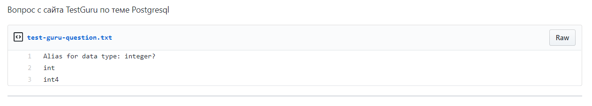

# :bulb::books: Project TestGuru
---
### Educational project from a programming school
###### by Alexandr Babitsky

__The project designed to create and various tests.__

##### Main technical parameters:
1. Ruby version - ***2.7.0***
2. Rails version - ***6.0.2***
3. Database - ***PostgreSQL***

##### Also implemented in the project:
* Main models:
    * User model
    * Admin model
* CRUD 
    * Tests
    * Categories
    * Questions
    * Answers
    * Badges
* Visual component
    * Bootstrap
* JS prat
    * Progress bar for tests
    * Password confirmation for authorization
    * Timer for tests 
    * Sort the question list
    * Editing title on question list page
* Mailers
    * Feedback mailer
    * Afte test passage mail message
    * Email verification after registration
* Authentication part created using ***Devise*** 
* Supported Languges
    * RU
    * ENG

#### Main functionality
**Passing tests**

**Timer and progress bar set during the test**

**An unknown question can be added to your GitGist, made with GitHub API**

**Possible to leave a feedback**

**Email notifictaiton with results is being sent, after passing the test**

*The project was created for educational purposes only!*

Under the direciton of [Thinknetica](https://thinknetica.com/)

_Creation date:_
> 04/03/2020

